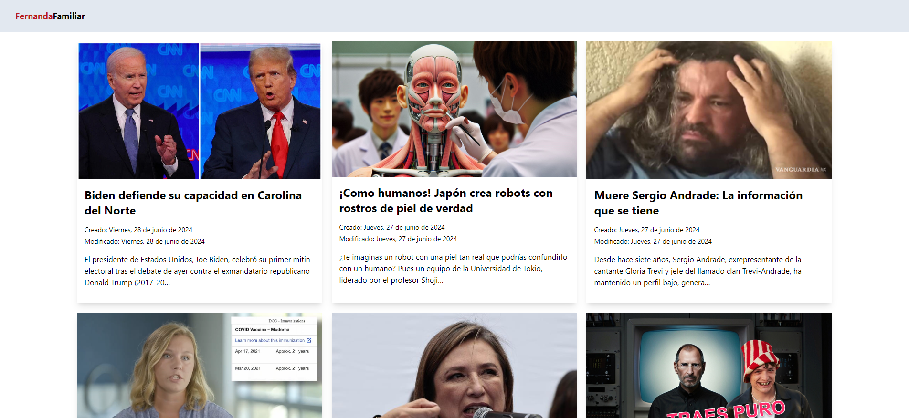

# Blog de Noticias

Este es un proyecto de blog de noticias de Fernanda Familiar desarrollado con React. Permite visualizar publicaciones obtenidas de una API de wordpress y marcarlas como leídas.

## Descripción

El proyecto consume datos desde una API y los muestra en un formato de tarjetas. Las publicaciones pueden ser marcadas como leídas al hacer clic en ellas, abriéndose en una nueva pestaña del navegador.

### Características

- Visualización de publicaciones en formato de tarjetas.
- Marcado de publicaciones como leídas.
- Persistencia de datos en `localStorage`.

## Demo

Puedes ver la demo del proyecto desplegado en Netlify [aquí](https://6682bdc70473b72812101451--relaxed-hamster-c7757b.netlify.app/).

## Captura de Pantalla

## Instalación

Sigue estos pasos para ejecutar el proyecto en tu máquina local:

1. Clona el repositorio: `git clone https://github.com/tu-usuario/tu-repositorio.git`

2. Navega al directorio del proyecto `cd tu-repositorio`

3. Instala las dependencias: `npm install`

4. Inicia el servidor de desarrollo: `npm run dev`

5. Dirígete a la url indicada en la consola
